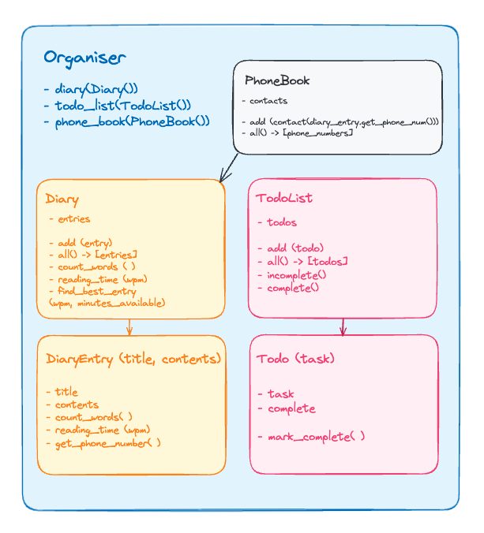

# {{Organiser}} Multi-Class Planned Design Recipe

## 1. Describe the Problem

As a user  
So that I can record my experiences  
I want to **keep** a regular **diary**  

As a user  
So that I can reflect on my experiences  
I want to **read** my **past diary entries**  

As a user  
So that I can reflect on my experiences in my busy day  
I want to **select diary entries** to read based on how much **time I have** and **my reading speed**

As a user  
So that I can keep track of my **tasks**  
I want to **keep** a **todo list** along with my diary  

As a user  
So that I can keep track of my **contacts**  
I want to **see** a **list of all of the mobile phone numbers** in **all my diary entries**  

A phone number is 11 digits long and starts with zero. It will be stored as a string (integers starting with a 0 are illegal in Python, except zero itself).  

## 2. Design the Class System

_The diagram below shows the classes and their relationships._



_Interface design of each class in more detail._

```python
# File: lib/organiser.py
class Organiser:
    def __init__(self): 
        # Parameters:
        #   diary: an instance of Diary
        #   todo_list: an instance of TodoList
        #   phone_book: an instance of PhoneBook
        pass
    
# Leave Organiser for now as not building a user interface in this exercise
# and isn't necessary for fulfilling the user stories/requirements given.


# File: lib/diary.py
class Diary:
    def __init__(self):
        pass

    def add(self, entry):
        # Parameters:
        #   entry: an instance of DiaryEntry
        # Returns:
        #   Nothing
        # Side-effects:
        #   Adds the entry to the entries list
        pass

    def all(self):
        # Returns:
        #   A list of instances of DiaryEntry
        pass

    def count_words(self):
        # Returns:
        #   An integer representing the number of words in all diary entries
        #   This method will make use of the `count_words` method on DiaryEntry.
        pass

    def reading_time(self, wpm):
        # Parameters:
        #   wpm: an integer representing the number of words the user can read per minute
        # Returns:
        #   An integer representing an estimate of the reading time in minutes
        #   if the user were to read all entries in the diary.
        pass

    def find_best_entry_for_reading_time(self, wpm, minutes):
        # Parameters:
        #   wpm: an integer representing the number of words the user can read per minute
        #   minutes: an integer representing the number of minutes the user has to read
        # Returns:
        #   An instance of DiaryEntry representing the entry that is closest to,
        #   but not over, the length that the user could read in the minutes
        #   they have available given their reading speed.
        pass


# File: lib/diary_entry.py
class DiaryEntry:
    # Public Properties:
    #   title: a string
    #   contents: a string

    def __init__(self, title, contents): # title, contents are strings
        # Side-effects:
        #   Sets the title and contents properties
        pass

    def count_words(self):
        # Returns:
        #   An integer representing the number of words in the contents
        pass

    def reading_time(self, wpm):
        # Parameters:
        #   wpm: an integer representing the number of words the user can read
        #        per minute
        # Returns:
        #   An integer representing an estimate of the reading time in minutes
        #   for the contents at the given wpm.
        pass

    def get_phone_number(self):
        # Returns:
        #   A list of strings representing a contact and their phone number


# File: lib/phone_book.py
class PhoneBook:
    def __init__(self):
        # Parameters:
        #   contacts: a nested list of contact objects

    def add(self, contact):
        # Parameters:
        #   contact: a list of strings representing a contact and their phone number
        # Returns:
        #   Nothing
        # Side-effects:
        #   Adds the contact to the contacts list
        pass

    def all(self):
        # Returns:
        #   A nested list of contacts
        pass


# File: lib/todo_list.py
class TodoList:
    def __init__(self):
        pass

    def add(self, todo):
        # Parameters:
        #   todo: an instance of Todo
        # Returns:
        #   Nothing
        # Side-effects:
        #   Adds the todo to the list of todos
        pass
      
    def incomplete(self):
        # Returns:
        #   A list of Todo instances representing the todos that are not complete
        pass

    def complete(self):
        # Returns:
        #   A list of Todo instances representing the todos that are complete
        pass


# File: lib/todo.py
class Todo:
    # Public Properties:
    #   task: a string representing the task to be done
    #   complete: a boolean representing whether the task is complete

    def __init__(self, task):
        # Parameters:
        #   task: a string representing the task to be done
        # Side-effects:
        #   Sets the task property
        #   Sets the complete property to False
        pass

    def mark_complete(self):
        # Returns:
        #   Nothing
        # Side-effects:
        #   Sets the complete property to True
        pass

```

## 3. Create Examples as Integration Tests

_Examples of the classes being used together in different situations and
combinations that reflect the ways in which the system will be used._

```python
# TODO: update for current project

"""
Given a library
When we add two tracks
We see those tracks reflected in the tracks list
"""
library = MusicLibrary()
track_1 = Track("Carte Blanche", "Veracocha")
track_2 = Track("Synaesthesia", "The Thrillseekers")
library.add(track_1)
library.add(track_2)
library.tracks # => [track_1, track_2]
```

## 4. Create Examples as Unit Tests

_Examples, where appropriate, of the behaviour of each relevant class at
a more granular level of detail._

```python
# TODO: update for current project

"""
Given a track with a title and an artist
We see the title reflected in the title property
"""
track = Track("Carte Blanche", "Veracocha")
track.title # => "Carte Blanche"
```

_Encode each example as a test. You can add to the above list as you go._

## 5. Implement the Behaviour

_After each test you write, follow the test-driving process of **red, green,
refactor** to implement the behaviour._